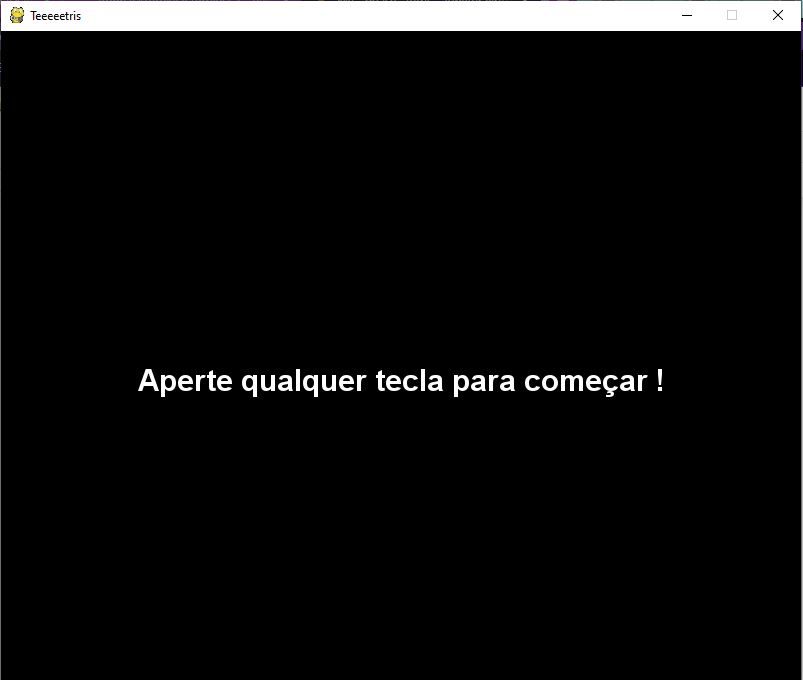
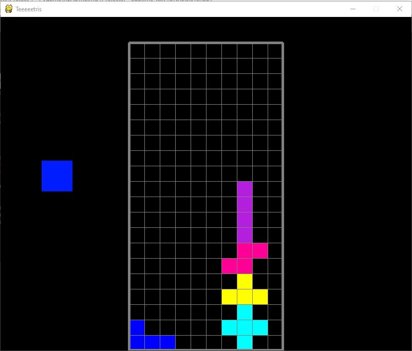
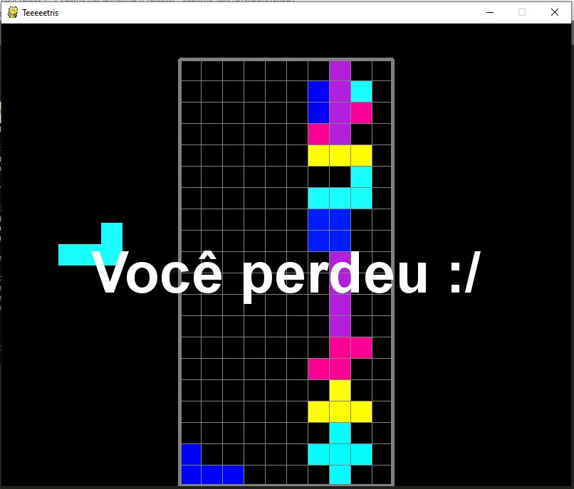

# PROJETO PYGAMES - TETRIS

## DESCRIÇÃO

- Neste projeto foi desenvolvido o famoso jogo chamado TETRIS

## Pré-Requisitos

1. PYTHON
2. JUPYTER NOTEBOOK
3. PYGAMES

## Como rodar o jogo

pip install pygame --user

Abrir o Jupyter Notebook e rodar o código clonado.

Segue as imagens abaixo:

  

  

  

